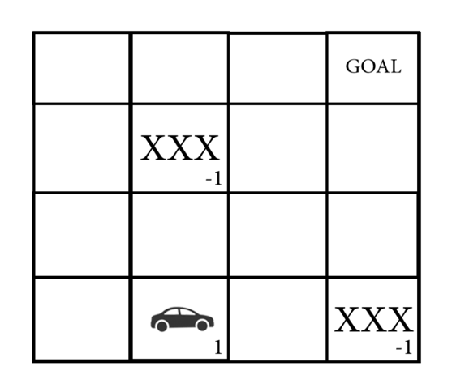

# Search Algorithms Application
 An application for the common search algorithms, for a university project on  ` Artificial Intelligence`


# 

<br>

<h2 align="center" style="font-weight: bold;">
before we get into running it, let's first get to know the general idea behind the project
</h2>


<br>
<br>
<br>

## Here, a 4x4 grid, implemented using a list/array, is our main focus getting into the problem

<br>


<br>

## Where a car is respawned at a random index/cell, a goal is selected randomly

<br>


<br>

## Also, a number of blocks gets respawned at random indices 
`(surely not the goal nor the car)`

<br>


<br>

## So, what else?
## The `problem` is all about the `car` reaching the `goal`, then we would need to specify the index of each of the `car`, `goal`, and other `blocks` found in the grid

<br>


<br>

## to work around that, we initially set the value of all cells to `0`. Then we `(for example)` set the `car` cell/position on the grid to be `1`, and the `blocks` to be `-1`


<br>




<br>

## and then let our algorithms do the work, handing out the `required strategy`, our `grid`, `goal and car` indices, etc


<br>

<h2 align="center" style="font-weight: bold;">
and that's about it.
</h2>

<br>

## 😎 **Quick start**

<br>

First, [download](https://www.python.org/downloads/) and install **Python**. Version `3.7` or higher is required.

Next, make sure you are in the root directory of this project and then just run the `problem.py` python file

```bash
python problem.py
```

That's all you need to know to start! ✅

<br>

## Note that
* ### You will get an automatic output/solution `(for an automatically generated problem)`, coming from the `computer_solve` function

* ### If you want to solve the generated problem yourself, you can figure that out using the last few commented lines found in `problem.py`

<br>
<br>
  
##  **Built with**

<br>

- [Python](https://www.w3schools.com/python/python_reference.asp) - Python is a popular programming language used in many fields.

<br>


## [License](https://github.com/mostafa-aboelnaga/Search-Algorithms-Application/blob/main/LICENSE)

MIT © [Mostafa Aboelnaga](https://github.com/mostafa-aboelnaga/)


